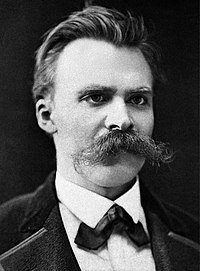

# Nietzsche

A Mustache wrap to render only perfect Mustache templates.  
Aka, monitor exceptions and missing variables.

## Getting Started

```bash
composer require ssitu/nietzsche
```

Will also require [SSITU/Blueprints](https://github.com/I-is-as-I-does/Blueprints) 

* `FlexLogsTrait` and
* `FlexLogsInterface` specifically.  

This is a Psr-3 "logger aware" implementation with a fallback.  
If no use of other SSITU blueprints, you can download just those two files.

And, well, you will need [Mustache](https://github.com/bobthecow/mustache.php/wiki) too.

## How to

### Init 

```php
use SSITU\Nietzsche\Nietzsche;

require_once '/path/to/vendor/autoload.php';
$Nietzsche = new Nietzsche();
```

### Log

```php
# optional:
$Nietzsche->setLogger($somePsr3Logger);
# alternatively, you can retrieve logs that way:
$Nietzsche->getLocalLogs();
// if no logger set: returns all logs history;
// else: only last entry
```

### Run

```php

$v_ = ["planet"=>"world"]; #could also be an object, as specified by Mustache doc
$viewName = "hello";
$viewDir = "path/to/views/";
$mustacheOpts = []; # cf. Mustache doc

// will either render your template, 
// or false if something went wrong --like a missing variable
$Nietzsche->renderPerfectMustache($v_, $viewName, $viewDir, $mustacheOpts);
```



## Contributing

Sure! You can take a loot at [CONTRIBUTING](CONTRIBUTING.md).

## License

This project is under the MIT License; cf. [LICENSE](LICENSE) for details.